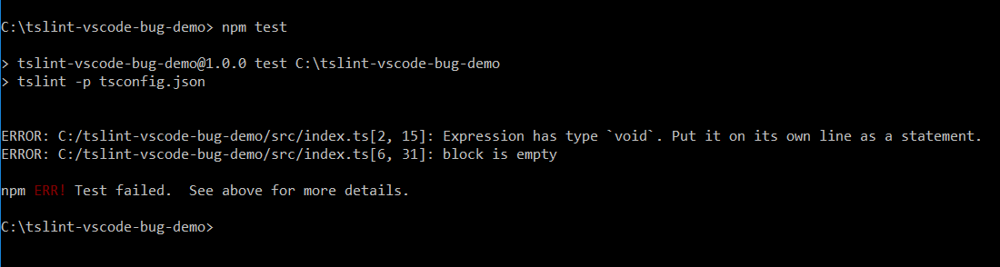
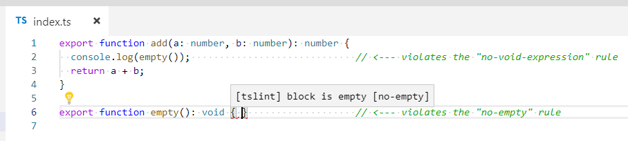

Bug Repro
==============================
This repo is a minimalistic reproduction of a bug in the [TSLint extension for VSCode](https://marketplace.visualstudio.com/items?itemName=eg2.tslint).  It demonstrates that some linter errors **don't** appear in VSCode, but **do** appear when TSLint is run from the command-line.

Explanation
-------------------------

### TSLint Config
This project only has two TSLint rules enabled:

[**tslint.yaml**](tslint.yaml)

```yaml
rules:
  no-empty: true
  no-void-expression: true
```


### TypeScript Code
This project has a single TypeScript code file that contains a violation of each of these rules:

[**index.ts**](src/index.ts)

```typescript
export function add(a: number, b: number): number {
  console.log(empty());                             // <--- violates the "no-void-expression" rule
  return a + b;
}

export function empty(): void { }                   // <--- violates the "no-empty" rule
```


### TSLint Results
When running TSLint from the command-line, it shows both errors, as expected:




### VSCode Results
The TSLint Extension for VSCode correctly shows the "no-empty" error on line 6, but notice that it _does not_ show the "no-void-expression" error on line 2:


